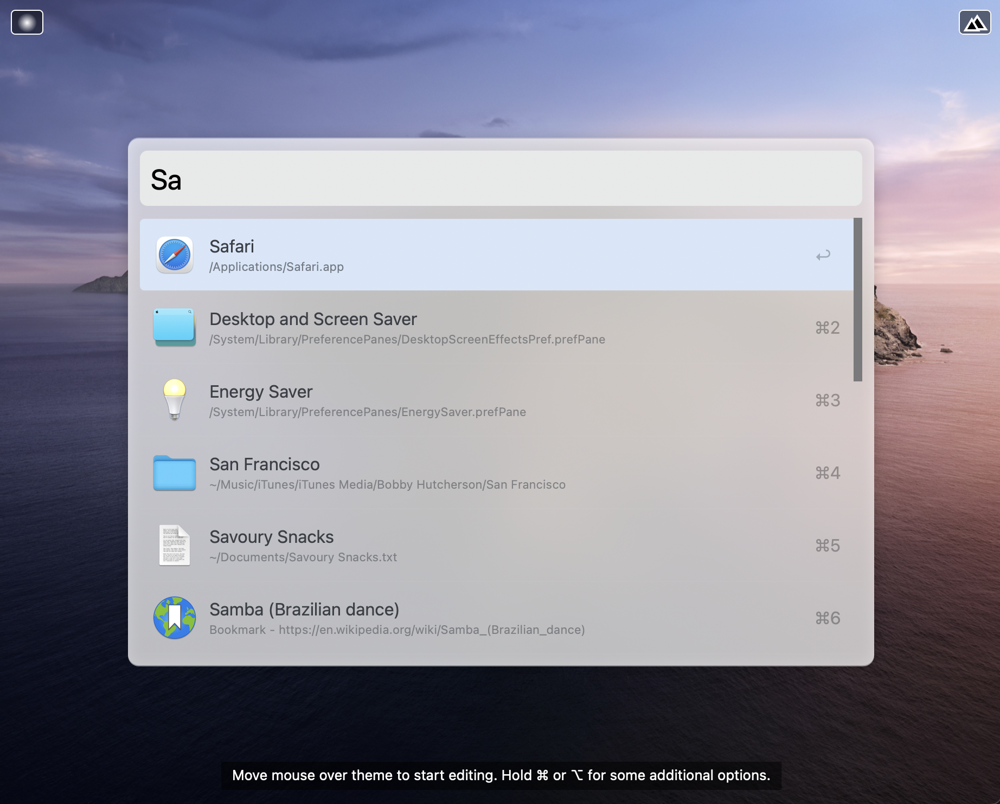
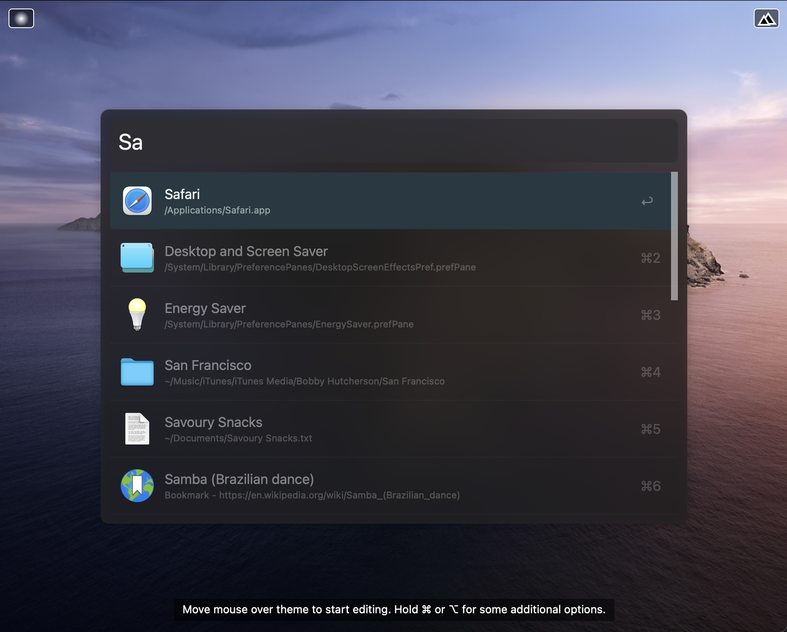

# Craft Powerpack Theme

Here are two [Alfred Powerpack Themes](https://www.alfredapp.com/help/appearance/) based on [Craft](https://craft.do), "a fresh take on
documents" for the Mac and iOS ecosystem.

This theme takes advantage of [new Window Blur features](https://www.alfredforum.com/topic/16238-alfred-43-pre-release-big-sur-theming-improvements/) for macOS Big Sur that landed in Alfred 4.3. As a result, this theme should be considered experimental and may not display properly on earlier versions of Alfred.

## Installation

Download the zip file below, unzip the file, and then double-click the `.alfredappearance` file to install it.

## Previews

### Craft Theme Light

  <a href="https://github.com/chrismessina/alfred-theme-craft/raw/main/craft-theme-light.zip" class="button">
    Download Theme
  </a>

### Craft Theme Dark

  <a href="https://github.com/chrismessina/alfred-theme-craft/raw/main/craft-theme-dark.zip" class="button">
    Download Theme
  </a>

## Suggested configuration

Disable the Alfred hat logo by unchecking: `Alfred Preferences › Appearance › Options › Hide hat on Alfred window`

Disable result shortcuts by unchecking: : `Alfred Preferences › Appearance › Options › Hide result shortcuts`

Simplify results by switching the result subtext to "Only for Alternative Actions".

## About

This theme is unaffiliated with nor endorsed by Craft.

<a href="https://www.alfredforum.com/topic/15740-a-theme-inspired-by-the-1980s-like-synthwave-84-for-vs-code/">Alfred Forum link</a>.
